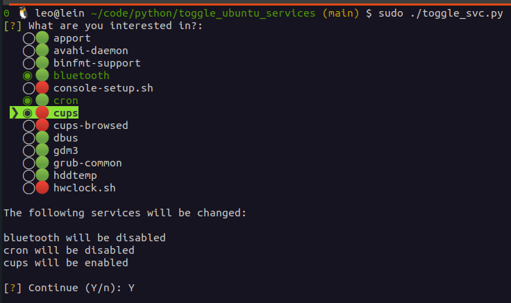

# toggle_ubuntu_services

Little script to enable/disable system services on a single shot with a simple toggle/checkbox menu.

_Behind the scenes_, this script runs a "service <service-name> stop|start" command.

The script needs to be run as root (sudo).

## Donation / Sponsorship ❤️ 👍

This code was brought to you by [Leo Gutiérrez](https://github.com/leogtzr) in his free time. If you want to thank me and support the development of this project, please make a small donation on [PayPal](https://www.paypal.me/leogtzr). In case you also like my other open source contributions and articles, please consider motivating me by becoming a sponsor/patron on [Patreon](https://www.patreon.com/leogtzr). Thank you! ❤️
